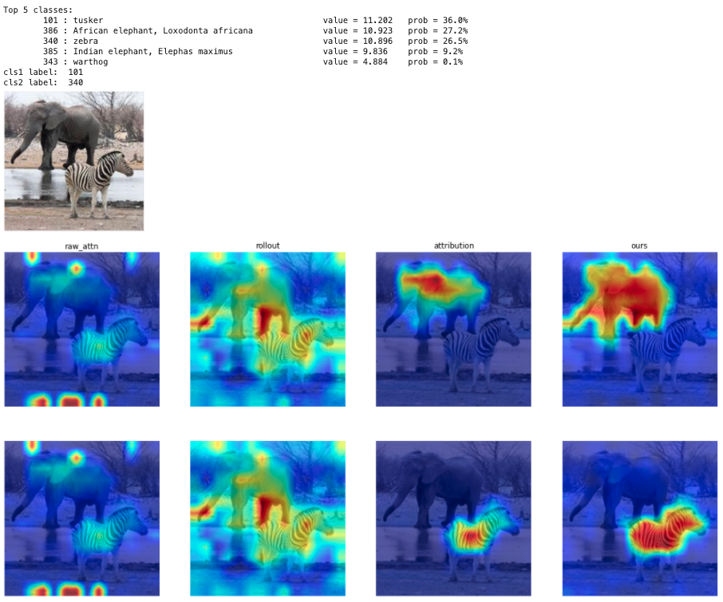

# Transition Attention Maps
Official implementation of Transition Attention Maps for Transformer Interpretability.

We provide a [jupyter notebook](./tutorials.ipynb) for quickly experience the visualization of our approach, as shown in the figure.

## Introduction

We introduce an explainability method which is able to visualize classifications made by a transformer-based model. You can enter a target category to see the motivations behind that prediction or decision of this category.

The pipeline of our proposed method **Transition Attention Maps** is as followed:

## Credits
ViT implementation is based on:
- <https://github.com/hila-chefer/Transformer-Explainability>
- <https://github.com/rwightman/pytorch-image-models>
- <https://github.com/lucidrains/vit-pytorch>
- Pretrained weights from: <https://github.com/google-research/vision_transformer>

Evaluation experiments is based on:
- [Perturbation test](https://github.com/hila-chefer/Transformer-Explainability)
- [Deletion & Insertion](https://github.com/eclique/RISE)
- [Energy-based pointing game](https://github.com/haofanwang/Score-CAM)
- [Weakly-Supervised Semantic Segmentation](https://github.com/OFRIN/PuzzleCAM)

## Reproducing evaluation results
Use argument `--arch` to choose model architecture.

Support: 
- vit_base_patch16_224(default)
- vit_large_patch16_224
- deit_base_patch16_224

Using the `--method` argument to choose the explainability method you want.

Support: 
- tam(default)
- raw_attn
- rollout
- attribution

### Deletion & Insertion

    CUDA_VISIBLE_DEVICES=0 PYTHONPATH=./:$PYTHONPATH python3 baselines/ViT/del_ins.py --method tam
    
The `--num_samples` argument is used to set the number of test samples (default: 2000). The `--batch_size` argument is used to set the batch size (default: 8).

### Energy-based Pointing Game

    CUDA_VISIBLE_DEVICES=0 PYTHONPATH=./:$PYTHONPATH python3 baselines/ViT/energy_point_game.py --method tam
    
The `--num_samples` argument is used to set the number of test samples (default: 2000). The `--batch_size` argument is used to set the batch size (default: 8).

### Perturbation Test
    # step 1:
    CUDA_VISIBLE_DEVICES=0 PYTHONPATH=./:$PYTHONPATH python3 baselines/ViT/generate_visualizations.py --method tam --imagenet-validation-path /path/to/imagenet_validation_directory
    
    # step 2:
    CUDA_VISIBLE_DEVICES=0 PYTHONPATH=./:$PYTHONPATH python3 baselines/ViT/pertubation_eval_from_hdf5.py --method tam

You can add the `--neg` argument to generate negative perturbation result.

### Segmentation Results

    CUDA_VISIBLE_DEVICES=0 PYTHONPATH=./:$PYTHONPATH python3 baselines/ViT/imagenet_seg_eval.py --method tam --imagenet-seg-path /path/to/gtsegs_ijcv.mat
    
You must provide a path to imagenet segmentation data in `--imagenet-seg-path`.

